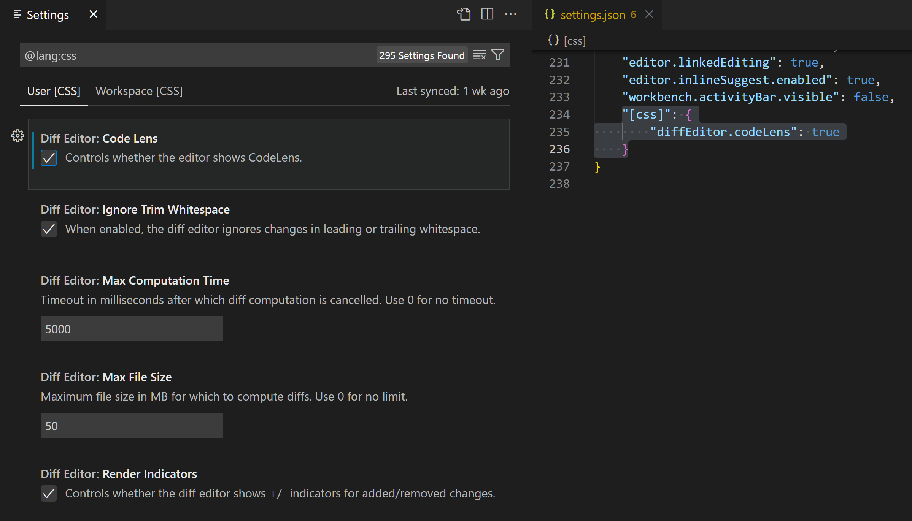

# SE-Assignment-5
Installation and Navigation of Visual Studio Code (VS Code)
 Instructions:
Answer the following questions based on your understanding of the installation and navigation of Visual Studio Code (VS Code). Provide detailed explanations and examples where appropriate.

 Questions:

1. Installation of VS Code:
   - Describe the steps to download and install Visual Studio Code on Windows 11 operating system. Include any prerequisites that might be needed.
Download the installer:
Open your web browser.
Go to the official Visual Studio Code download page: [download visual studio code ON code.visualstudio.com]
Click the button "Download for Windows" (or similar wording based on the current version).
Run the installer:
Once the download is complete, locate the downloaded file (usually in your Downloads folder).
The file name will be something like "VSCodeUserSetup-{version}.exe". Double-click it to start the installation.
Follow the installation wizard:
The installation wizard will launch. You might see a security prompt, click "Run" to proceed.
The wizard will likely present the license agreement. You can review it (recommended) and then click "Next" to accept.
Choose an installation location if you want to customize it (default is usually fine). Click "Next" to continue.
Select optional components if offered (e.g., launcher icon). Click "Next" again.
Finally, click "Install" to begin the installation process.
Complete the installation:
The installer will take a few moments to install Visual Studio Code.
Once done, you'll likely be given the option to launch Visual Studio Code right away. You can choose to do that or click "Finish" to exit the wizard.

2. First-time Setup:
   - After installing VS Code, what initial configurations and settings should be adjusted for an optimal coding environment? Mention any important settings or extensions.
Interface Customization:
Theme: VS Code offers a variety of themes (light and dark) to choose from. Pick one that is easy on your eyes and suits your preferences. You can find them in the Settings menu (File > Preferences > Settings or Code > Preferences > Settings on macOS) under the "Appearance" section.
Code Formatting and IntelliSense:
Install Extensions: Enhance VS Code's functionality with extensions for specific programming languages you use. Popular options include:
Prettier: Automates code formatting for consistent style.
ESLint/TSLint: Identifies and fixes potential errors and style issues.
Language-specific IntelliSense extensions provide code completion and suggestions.
Settings: You can further adjust formatting rules within VS Code settings for indentation, spacing, and other stylistic preferences.
Version Control:
If you plan to use Git for version control, consider installing the built-in Git extension or a more advanced Git extension like "GitLens" for a richer Git experience.
Keyboard Shortcuts:
VS Code supports many keyboard shortcuts for navigation and actions. Explore the default shortcuts or customize them in the Settings menu under "Keyboard Shortcuts" to suit your workflow.
Workspace Management:
Configure VS Code to open your preferred folders or projects automatically on startup. You can set this in the Settings under "Window" > "Window Placement".
Terminal Integration:
Enable the integrated terminal within VS Code (Terminal > New Terminal) for easy access to the command line within your coding environment.

3. User Interface Overview:
   - Explain the main components of the VS Code user interface. Identify and describe the purpose of the Activity Bar, Side Bar, Editor Group, and Status Bar.
Activity Bar (far left): This vertical bar provides quick access to different views in VS Code. It contains icons for:
Explorer: Manage your project files and folders.
Search: Find text across your project.
Source Control (Git): View and manage your code versions (if Git is integrated).
Debug: Launch and debug your code.
Extensions: Access and manage installed extensions.
Terminal: Open an integrated terminal window.
Other views can be added depending on installed extensions.
Side Bar (optional, takes space next to the Activity Bar): This area displays the currently selected view from the Activity Bar. You can choose to hide it (View > Appearance > Hide Side Bar) for more screen space.
Editor Group (main central area): This is where you write and edit your code. You can open multiple files or folders simultaneously, with each displayed in a separate tab within the Editor Group. Features like:
Split View: Divide the Editor Group to view and edit two files side-by-side.
Minimap: Provides an overview of the current file and allows quick navigation.
Status Bar (bottom): This bar displays information about your project and the files you're working on. It can show details like:
Current line number and column position.
Active Git branch (if using Git).
Encoding of the file.
Selection mode (inserting or overwriting text).
Background tasks running (like compilation)

4. Command Palette:
   - What is the Command Palette in VS Code, and how can it be accessed? Provide examples of common tasks that can be performed using the Command Palette.
The Command Palette in VS Code is a powerful search bar that allows you to access all functionalities within the editor, even those without dedicated menu buttons. It's a great way to quickly find and execute specific actions without memorizing keyboard shortcuts.
Accessing the Command Palette:
There are three ways to open the Command Palette:
Keyboard Shortcut: The most common way is by pressing Ctrl+Shift+P (Windows/Linux) or Cmd+Shift+P (Mac).
Menu: Go to the View menu and select Command Palette.
Search Bar: Click on the magnifying glass icon in the top right corner of the VS Code window.
Using the Command Palette:
Once opened, the Command Palette displays a search bar where you can type in keywords or phrases related to the desired action. As you type, VS Code will start filtering and suggesting relevant commands.
Examples of Common Tasks:
Here are some examples of common tasks you can perform using the Command Palette:
File Management:
Open a specific file: Type the file name and select it from the suggestions.
Create a new file: Type "New File" and press Enter.
Open a folder: Type "Open Folder" and select the desired folder.
Code Editing:
Find and replace text: Type "Find" or "Replace".
Format code: Type "Format Document".
Toggle comments: Type "Comment Line" or "Uncomment Line".
Project Management:
Open integrated terminal: Type "Terminal".
Start debugging: Type "Debug".
Search for symbols (functions, variables): Type "Go to Symbol".
Settings and Extensions:
Open settings: Type "Settings".
Install extensions: Type "Extensions: Install Extension".
View installed extensions: Type "Extensions: Manage Extensions".

5. Extensions in VS Code:
   - Discuss the role of extensions in VS Code. How can users find, install, and manage extensions? Provide examples of essential extensions for web development.
Visual Studio Code is a powerful code editor out of the box, but extensions take it to a whole new level of functionality. Extensions are essentially add-ons that contribute new features and functionalities to VS Code, allowing you to customize your development environment to fit your specific needs and preferences.
There are two main ways to find and install extensions in VS Code:
VS Code Marketplace: This built-in marketplace is directly accessible within VS Code. You can open it by going to the Extensions view (View > Extensions). Here you can browse extensions by category, popularity, or search for specific functionalities using the search bar.
External Websites: Many developers create extensions and share them on external websites. You can find these extensions through online searches, and often they will link you back to the VS Code Marketplace for installation.
Once you've found an interesting extension, simply click the "Install" button for it within the VS Code Marketplace. VS Code will handle the download and installation process.
To manage your installed extensions, go back to the Extensions view. Here you can see a list of all your installed extensions, update them to the latest versions, disable them temporarily, or completely uninstall them if needed.
Language-specific extensions:
HTML, CSS, JavaScript (built-in): Provide syntax highlighting, code completion, and basic linting for these core web development languages.
TypeScipt: For those using TypeScript, this extension adds support for type checking and enhanced IntelliSense.
Linters and Formatters:
ESLint/TSLint: Identify and fix potential errors and stylistic issues in your JavaScript/TypeScript code.
Prettier: Automates code formatting to ensure consistent style across your project.
Debuggers:
Live Server: Launches a local development server to preview your webpages with live reloading as you make changes.
Debugger for Chrome/Firefox: Enables debugging your web applications directly within VS Code using Chrome or Firefox DevTools.
Version Control:
GitLens: Provides a rich visual interface for Git version control, making it easier to navigate your code history and collaborate with others.

6. Integrated Terminal:
   - Describe how to open and use the integrated terminal in VS Code. What are the advantages of using the integrated terminal compared to an external terminal?
The VS Code integrated terminal provides a convenient way to interact with the command line directly within your coding environment. Here's how to open and use it:
Opening the Terminal:
Keyboard Shortcut: The quickest way is by pressing Ctrl+ (backtick) (Windows/Linux) or Cmd+ (backtick) (Mac).
Menu: Navigate to Terminal > New Terminal in the top menu bar.
Using the Terminal:
Once opened, the terminal panel appears at the bottom of the VS Code window. You can interact with it just like any regular command line terminal. Type your desired commands and press Enter to execute them.
Advantages of the Integrated Terminal:
There are several advantages to using the integrated terminal compared to an external terminal application:
Convenience: No need to switch between windows or applications. Everything you need for coding and interacting with the command line is readily available in the same workspace.
Split View: Easily split the VS Code window to have your code editor side-by-side with the terminal, allowing you to quickly reference code and execute commands simultaneously.
Working Directory: The integrated terminal automatically opens in the root directory of your current workspace, eliminating the need to navigate there manually.
Integration with VS Code Features:
Command Palette: Search for and run terminal commands directly from the Command Palette within VS Code.
Task Runner: Configure tasks in VS Code (like building or running your project) that can be executed directly from the integrated terminal.
Output Parsing: VS Code can sometimes parse the output of certain commands from the integrated terminal and highlight relevant information or errors within the editor itself.

7. File and Folder Management:
   - Explain how to create, open, and manage files and folders in VS Code. How can users navigate between different files and directories efficiently?
Creating Files and Folders:
New File:
Right-click inside an existing folder in the Explorer sidebar (View > Explorer).
Select "New File" from the context menu.
Give your file a name and press Enter.
New Folder:
Right-click inside an existing folder or directly in the Explorer sidebar.
Select "New Folder" from the context menu.
Give your folder a name and press Enter.
Opening Files and Folders:
Double-clicking: The most common way is to double-click on a file or folder name in the Explorer sidebar. This will open the file in the editor or navigate into the folder, respectively.
Command Palette: Open the Command Palette (Ctrl+Shift+P or Cmd+Shift+P) and type "Open File" or "Open Folder". Search for the desired file or folder name and select it to open.
Managing Files and Folders:
Renaming: Right-click on a file or folder and select "Rename" from the context menu. Edit the name and press Enter.
Deleting: Right-click on a file or folder and select "Delete" from the context menu. Caution: This action is permanent, so be sure you want to delete the item.
Moving and Copying: Right-click on a file or folder and choose "Cut" or "Copy" from the context menu. Navigate to the destination folder, right-click, and select "Paste" to move or copy the item.
Drag and Drop: Drag and drop files and folders between locations within the Explorer sidebar to easily rearrange them.
Efficient Navigation:
Explorer Sidebar: This sidebar provides a visual tree structure of your project, allowing you to quickly browse and open files and folders.
Go to File: Open the Command Palette (Ctrl+Shift+P or Cmd+Shift+P) and type "Go to File". Start typing the name of the file you want to open, and VS Code will suggest matching files as you type. Select the desired file to open it.
Recent Files: VS Code maintains a list of recently opened files. You can access this list by going to File > Open Recent in the menu bar.
Keyboard Shortcuts: VS Code offers various keyboard shortcuts for navigation, including:
Ctrl+Tab or Cmd+Tab (switch between open editor tabs)
Ctrl+P or Cmd+P (Quick Open - filter and open files)
Ctrl+Shift+E or Cmd+Shift+E (Open Recent Files)

8. Settings and Preferences:
   - Where can users find and customize settings in VS Code? Provide examples of how to change the theme, font size, and keybindings.
Accessing Settings:
There are two main ways to access settings in VS Code:
Menu: Go to File > Preferences > Settings (Windows/Linux) or Code > Preferences > Settings (Mac).
Command Palette: Open the Command Palette (Ctrl+Shift+P or Cmd+Shift+P) and type "Preferences: Open Settings".
Customizing Settings:
The settings editor displays a searchable list of all configurable options. You can search for specific settings or browse through categories. Here are some examples of customization:
Change Theme:
Search for "Color Theme" in the settings.
A dropdown menu will appear with available themes. Select the theme you prefer (e.g., "Dark+ Default").
Adjust Font Size:
Search for "Font Size".
An input field will appear where you can enter your desired font size in pixels (e.g., 14).
Modify Keybindings:
Search for "Keyboard Shortcuts".
This opens a JSON file where you can define custom keyboard shortcuts for various actions. There's also a section for searching for existing shortcuts.
Caution: Editing JSON requires some familiarity with the format. It's recommended to search for online resources or extensions for keyboard shortcut customization if you're new to JSON.
Additional Customization:
Settings File: All your settings are stored in a JSON file called "settings.json". You can access it directly if you prefer more precise editing (File > Preferences > Settings > Open Settings (JSON)). However, modifying this file directly is also recommended for experienced users only.
Extensions: Many extensions offer additional settings specific to their functionalities. You can usually find these settings within the extension's configuration options.

9. Debugging in VS Code:
   - Outline the steps to set up and start debugging a simple program in VS Code. What are some key debugging features available in VS Code?
Prerequisites:
Supported Language: Ensure your program is written in a language supported by VS Code debugging (e.g., Python, JavaScript, C++). You might need to install additional language extensions.
Launch Configuration: Create a launch configuration file (.vscode/launch.json) that specifies how VS Code should launch your program for debugging. Most of the time, VS Code will generate a basic launch configuration upon first attempt to debug.
Create a Launch Configuration (if needed):
Open the Command Palette (Ctrl+Shift+P or Cmd+Shift+P).
Type "debug configuration" and select the option to create a launch configuration file.
Choose a template appropriate for your program's language and execution environment.
Edit the launch.json file to specify details like program path, arguments, and debugging environment variables (if needed).
Set Breakpoints:
Open the source code file of your program in the editor.
Click on the line number where you want to pause execution during debugging. A red dot will appear indicating a breakpoint.
Start Debugging:
Open the Run and Debug view (Ctrl+Shift+D or Cmd+Shift+D).
Select the desired launch configuration from the dropdown menu (if you have multiple configurations).
Click the green Start button (play icon) or press F5.
Debugging Features:
Once the program execution pauses at a breakpoint, VS Code offers various debugging features:
Step Over (F10): Executes the current line of code but skips over function calls.
Step Into (F11): Executes the current line of code and steps into any function calls.
Step Out (Shift+F11): Steps out of the current function call and resumes execution.
Set/Remove Breakpoints: Right-click on a line number to manage breakpoints.
Inspect Variables: View the values of variables in the Variables pane (Debug > Variables).
Call Stack: See the call stack to understand the function call hierarchy (Debug > Call Stack).
Console: Interact with your program by printing messages or inspecting values in the integrated terminal.
Remember: Specific debugging functionalities might vary slightly depending on the programming language and any extensions you're using.

10. Using Source Control:
    - How can users integrate Git with VS Code for version control? Describe the process of initializing a repository, making commits, and pushing changes to GitHub.
Initialize a Git Repository:
Open your project folder in VS Code.
Go to the Source Control view (View > Source Control or Ctrl+Shift+G).
Click the "+" button in the Source Control view and select "Initialize Repository".
This creates a new Git repository within your project folder, initializing the necessary files (.git) for version control.
Making Commits:
After making changes to your code, stage the changes you want to include in your next commit. You can stage individual files or lines of code, or stage all changes at once.
Stage specific lines: Right-click on a line of code and select "Stage Lines".
Stage a whole file: Right-click on a file in the Explorer sidebar and select "Stage Changes".
Stage all changes: Click the blue button in the Source Control view that says "Stage All Changes".
Once you've staged your desired changes, type a commit message summarizing the changes you made. A commit message is crucial for future reference.
Click the green checkmark button in the Source Control view (or press Ctrl+Enter) to commit your staged changes.
Pushing Changes to GitHub:
Assuming you have a remote repository set up on GitHub (like a project repository), you can push your local commits to it.
In the Source Control view, click on the "..." menu next to the branch name (usually "main").
Select "Publish Branch" if it's your first push, or "Push to <remote name>" if you've already connected.
You might be prompted to enter your GitHub credentials for authentication.
This pushes your local commits to the remote repository on GitHub, making your code changes accessible online and allowing for collaboration with others.
Additional Features:
VS Code's Git integration offers many more features beyond these basic steps:
Viewing Commit History: See a history of all your commits with the ability to revert to previous versions.
Branching and Merging: Create and manage different development branches and merge them back into your main branch.
Conflict Resolution: Resolve conflicts if different changes occur in the same part of the code across branches.
GitLens Extension (Optional): Install the GitLens extension for a richer Git experience with visualizations and advanced features.

 Submission Guidelines:
- Your answers should be well-structured, concise, and to the point.
- Provide screenshots or step-by-step instructions where applicable.
- Cite any references or sources you use in your answers.
- Submit your completed assignment by 1st July 